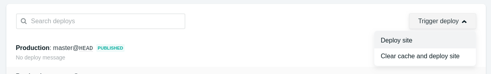

# Notion Page Downloader

### What can users do ?

* Run on a personal computer : Download a Notion page as a HTML file.
* Run on the cloud : Host a static version of a Notion page on [Netlify](https://www.netlify.com).

### How does this work ?

This small application uses the following three of my projects.

* [notionapi-agent](https://github.com/dragonman225/notionapi-agent) - Node.js wrapper for Notion's API.
* [notionast-util-from-notionapi](https://github.com/dragonman225/notionast-util-from-notionapi) - Convert Notion's response objects of a page to a special tree structure.
* [notionast-util-to-html](https://github.com/dragonman225/notionast-util-to-html) - Render HTML from the special tree structure.

## Demo

[View example page on Netlify](https://notion2netlify.netlify.com/) 

Also, you can take a look at `public/index.html`.

## Usage : Run on a personal computer

1. Clone this repository.

   ```bash
   git clone https://github.com/dragonman225/notion-page-downloader.git
   ```

2. Go into the repository.
   ```bash
   cd notion-page-downloader
   ```

3. If you use `npm`

   ```bash
   npm install
   ```

   Or, if you use `pnpm`

   ```bash
   pnpm install
   ```

4. Run setup script.

   ```bash
   npm run setup
   ```

5. Edit the `notionPageURL` field of `config.json`.

6. If the Notion page is private, you need to fill in your `token` in `config.json`. Follow this [guide](https://github.com/dragonman225/notionapi-agent/blob/master/docs/obtain_token.md) to obtain your token.

7. Download the page as `public/index.html`.

   ```bash
   npm run start
   ```

## Usage : Run on the cloud

1. [](https://app.netlify.com/start/deploy?repository=https://github.com/dragonman225/notion-page-downloader)

* To update the static page on Netlify, go to **Deploys** tab, trigger deploy.

   

* Private Notion pages can't be deployed. (Technically, it's possible, but giving your Notion login token to the cloud is dangerous. A Notion token is so powerful that anyone or any machine with it can control your Notion account.)

## Supported Blocks

Please view the list [here](https://github.com/dragonman225/notionast-util-to-html).

## Upgrade from Previous Versions

1. Delete `node_modules/` and `package_lock.json`.
2. Run `npm install` or `pnpm install`.